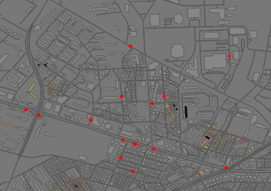
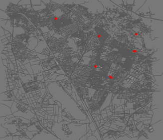

# RoboCup Resque Simulation의 멀티에이전트 강화학습을 위한 솔루션

## 1. Motivation 
------
* 기존 재난 시뮬레이션의 경우, 현재 활발히 연구 진행 중인 강화학습과의 연동을 고려하지 않은 경우가 많음. 
* 기존 재난 대응에 강화학습을 활용한 연구들은 주로 자신들이 구성한 재난 시뮬레이션 혹은 재난 환경을 그리드 환경과 같이 매우 단순한 환경으로 축약함. 

## 2. Objective
-----
* 기존 도시 화재 재난 시뮬레이션인 RoboCup Resque Simulation의 상태정보 및 화재 재난 대응을 위한 코드를 분석하고, 해당 부분을 파이썬 기반의 멀티 에이전트 강화학습 모델과 연동하는 방안을 분석 
* 도시 화재 시뮬레이션을 최적화하여 시 규모의 지도 데이터를 활용한 시뮬레이션과 학습이 가능하도록 개선

## 3. Method
-----
* 상태 정보의 해석(시뮬레이션 --> 강화학습 에이전트)
  * 대상 도시 화재 시뮬레이션 : 건물에 대한 화재 대응을 수행함. 따라서, 건물의 수가 많아질 수록 상태 정보의 크기 또한 증가함. 
  * 만약, 화재 발생 건물만을 고려한다면, 상태정보는 작아지지만 상태정보는 가변적인 크기로 정의가 되어 일반적인 딥러닝의 입력데이터가 되기 어려움. 
  * 고정된 크기의 입력 데이터를 정의하기 위해서 시뮬레이션 측으로부터의 화재 재난 상태 정보를 이미지 데이터로 변환함. 
  * 시뮬레이션 상태 정보의 해석을 위한 파이프라인
   </img>

  * 변환된 상태 정보 예시 

   </img>

* 행위 정보의 해석(강화학습 에이전트 --> 시뮬레이션)
  * 시뮬레이션 내 건물의 수가 증가함에 따라 강화학습 에이전트가 직접적으로 화재 대응 건물을 선택할 수 없음. 
    * 예 : 수원시 지도 데이터 : 16,184 개의 건물이 있음.
  * 따라서 강화학습 에이전트는 건물을 직접선택하지 않고, 건물이 지니는 특성 값을 예측하거나, 특성값에 대한 우선순위를 연속적인 값(continuous value)로 산출하는 역할을 수행하도록 구성함.
    * 제안하는 솔루션에서 해당 연속값을 대응하는 건물로 변환함. 

## 4. Evaluation Results (강화학습 솔루션은 MA-DDPG 모델에 적용함)

-----

### 4.1 원천동(아주대학교 인근) 화재 재난 시뮬레이션 및 학습 결과 
* 시뮬레이션 환경 : 화재 진압 팀(18팀), 건물 수(3,355개) 
   </img>

* 비교군 
  * 제안 솔루션 적용
  * 거리에 따른 탐욕 정책
  * [Goyal의 논문](https://github.com/animeshgoyal9/RoboCup_Rescue_Simulator_Gym_Integration/blob/master/GOYAL-REPORT-2020.pdf) 에서 제시된 탐욕 정책

* 실험 결과 
  * 화재 피해가 없는 경우를 100%, 건물이 모두 전소된 경우를 0%로 할때,
    * 강화학습 솔루션 적용 방식 : 99.2%
    * 거리 기반 탐욕 정책 : 77.2%
    * Goyal에서 제시된 탐욕 정책 : 57.1 %
  * 학습 그래프 

   </img>

### 4.2 수원시 화재 재난 시뮬레이션 및 학습 결과 

   </img>

* 비교군 
  * 보상 계산시 $reward = a* reward_{local} + b * reward_{global} $ 에서 b 값을 조정하면서 에이전트의 이기성(selfishness)를 바꾸어가며 비교함

* 실험 결과
  * 에이전트의 b 값이 낮을 수록 더 높은 화재 대응도를 보여주었으나, overfitting에 의해 화재 대응도가 낮아짐. 


   </img>

## 5. 실행방법
-------
### 5.1 Dependency
* PyTorch 1.8
* 지도데이터의 경우 OSM데이터를 GML 데이터로 변환하는 과정을 통해 구성할 수 있음. 
* 본 제안방식에서는 수원시 지도 데이터를 GML로 변경하기 위해 [이 Github 코드](https://github.com/Hosoya-ait/osm2RRSgml)를 수정하여 활용함. 
* 지도 규모가 커짐에 따라 rays라는 화재 시뮬레이션을 위한 정보를 빌드하는데 매우 긴 시간이 걸리니 주의바람. 

------
### 5.2 실행 스크립트 

* 서버에서 GUI를 구동하지 못하는 경우, headless 옵션을 조정해야함. 
  * function.sh 의 192줄 확인바람. 
  * 또한, start.sh 에서 startKernel 수행시 nogui 도 gui 관련 옵션임. 

* 파이썬 코드를 실행하면 자바프로세스를 같이 띄우고, 자바프로세스에서는 에피소드 별 스텝 수를 받아 스텝 수마다 시뮬레이션을 초기화함.   
  * RCRS 시뮬레이션에서 매 에피소드의 길이는 common.cfg의 episode.length를 통해 입력받고, 전체 시뮬레이션의 길이는 kernel.timestep에 의해 조정됨. 

```
~/.conda/envs/torch7/bin/python main.py --itr_before_train 33 --action_space 1 --alpha 1.0 --beta 0.01 --aux_reward 0.1 --scale_reward 0.01 --lr_scale 0.1 --out_activation 1.0 --final_beta=0.01 --init_beta 0.01 --file_prefix $SLURM_JOBID
```

